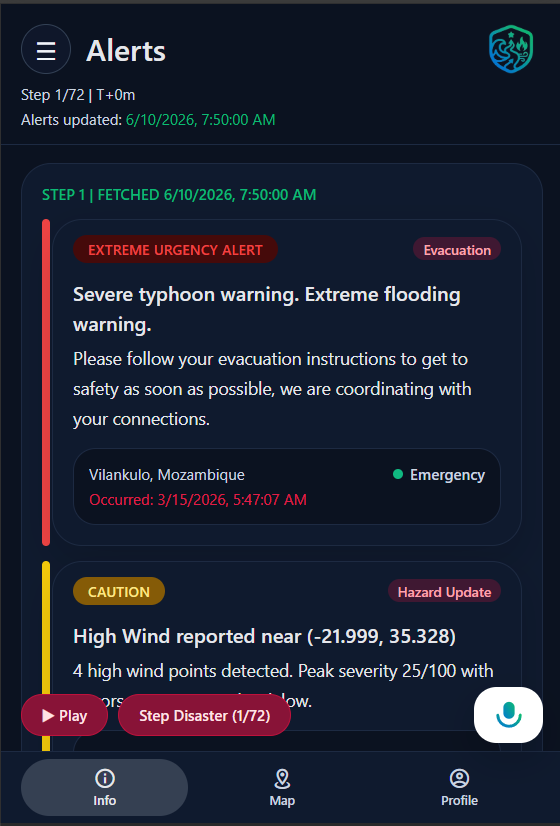
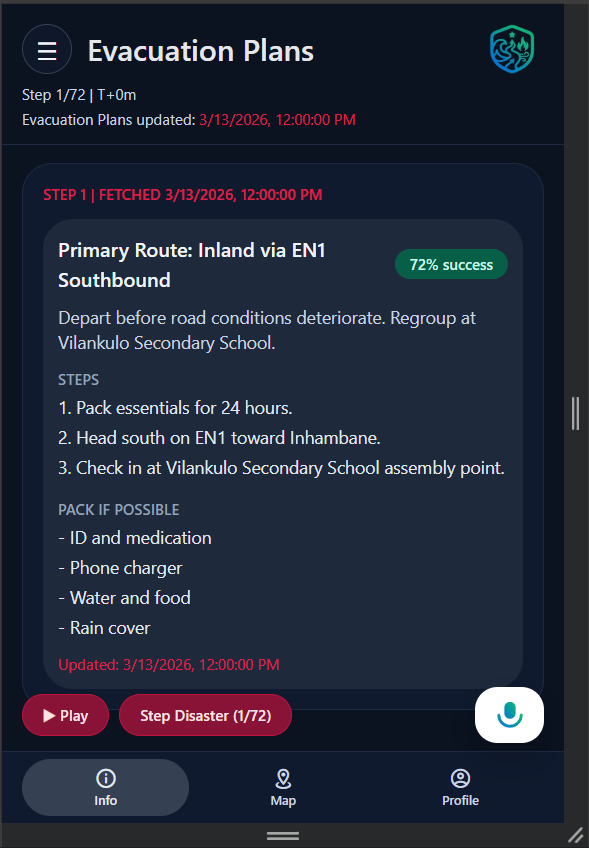
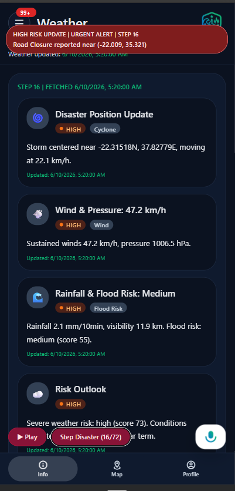
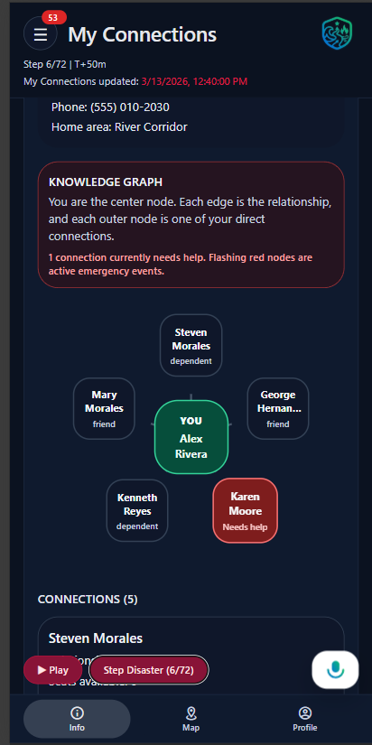
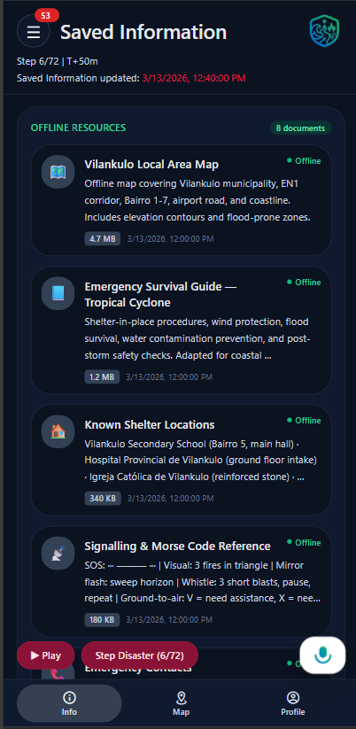
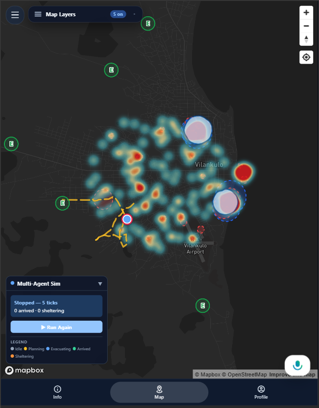
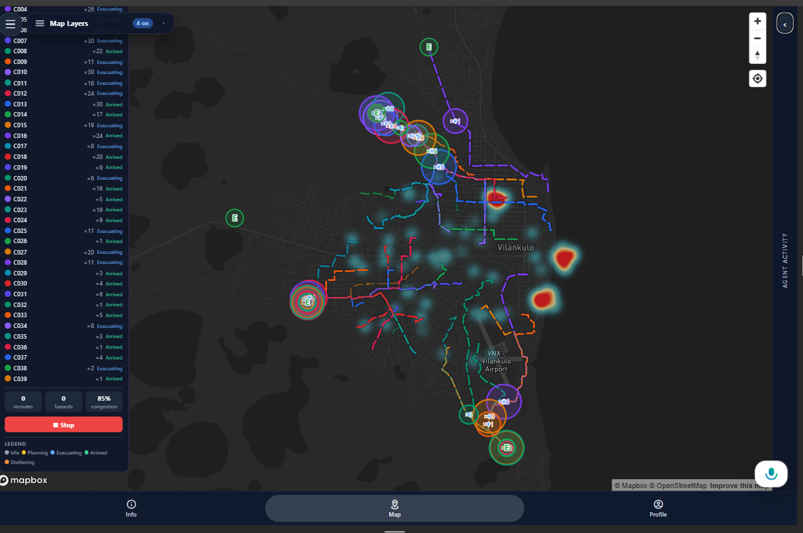
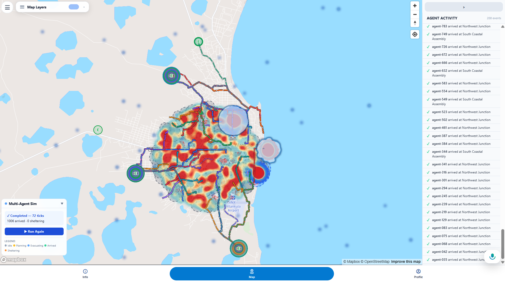
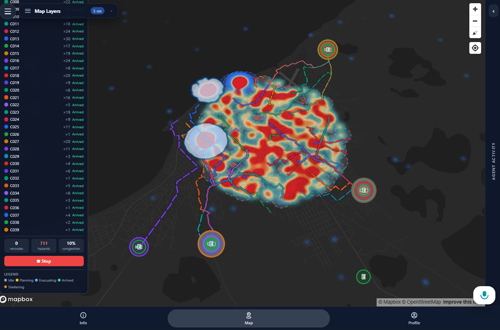
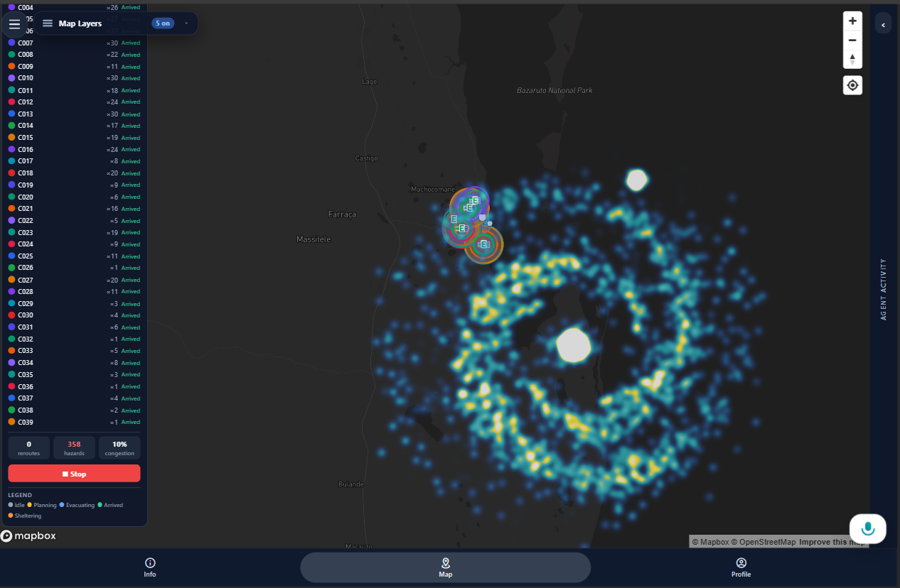

<p align="center">
  
</p>

<p align="center">
  
</p>

<h1 align="center">CrisisNet</h1>

A full-stack emergency evacuation planning platform that combines real-time hazard tracking, AI-driven multi-agent decision-making, and dynamic route planning to help people navigate disasters safely. Built with a FastAPI backend and an Expo React Native (TypeScript) frontend.

---

## Features

- **Dynamic evacuation routing** — Plans routes via Mapbox Directions API with automatic hazard avoidance and waypoint insertion around active danger zones
- **Real-time rerouting** — Server-Sent Events push route updates to clients when new hazards are reported
- **Multi-agent AI pipeline** — Chains specialized agents (assessment, risk profiling, routing, decision-making) powered by OpenAI and IBM watsonx to evaluate evacuation options
- **Live hazard tracking** — In-memory hazard store with Shapely polygon buffering and intersection detection for geometric hazard analysis
- **Multi-source data aggregation** — Pulls from NOAA, USGS, NASA FIRMS, GDACS, NHC, JTWC, IBTrACS, and Open-Meteo for weather, seismic, fire, flood, and storm data
- **Disaster simulation engine** — Runs multi-agent evacuation simulations with LLM-driven evacuee decision-making, streamed via SSE
- **Community connections** — Tracks interpersonal relationships and help-needed status during disasters
- **Cross-platform UI** — Expo React Native app with Mapbox maps, NativeWind styling, and platform-specific screen splits (web/native)

---

## App Screens

### Alerts

Real-time, urgency-coded alerts sourced from weather services and hazard detection systems. Each alert is tagged with a severity level (Extreme Urgency, Caution, Warning) and a category (Evacuation, Hazard Update) so users can immediately identify what requires action. Alerts update automatically as the disaster progresses through each simulation step.

<p align="center">
  
</p>

### Evacuation Plans

AI-generated evacuation plans with a scored success probability, step-by-step departure instructions, and a packing checklist. The AI agent pipeline evaluates the current disaster state, the user's personal risk profile, and available routes to recommend the safest evacuation strategy.

<p align="center">
  
</p>

### Weather Intelligence

A live weather dashboard displaying storm position tracking, wind speed and pressure readings, rainfall intensity with flood-risk scoring, and an overall risk outlook. Data is fetched from multiple external providers and updates with each disaster step.

<p align="center">
  
</p>

### My Connections

An interactive knowledge graph showing the user's social network during a crisis. Each node represents a connection (family, friends, dependents) with their relationship type and current status. Nodes flash red when a connection needs help, enabling users to coordinate mutual aid in real time.

<p align="center">
  
</p>

### Saved Information

Offline-ready emergency resources cached locally for use when connectivity is lost. Includes local area maps, survival guides tailored to the active disaster type, known shelter locations, and signalling/morse code references — each with file size and availability status.

<p align="center">
  
</p>

---

## Simulation Engine

The simulation system models multi-agent evacuation scenarios where each evacuee is an autonomous, LLM-driven agent that makes decisions based on personal context, risk tolerance, and available information.

### Single-Agent Simulation

A single evacuee navigates through active hazard zones (shown as a heatmap of wind, flood, and fire intensity). The platform computes a real-time evacuation route that dynamically avoids danger areas, with the agent's path traced across the map.

<p align="center">
  
</p>

### Multi-Agent Simulation

Hundreds of evacuee agents run simultaneously, each independently deciding when to depart, which route to take, and where to shelter. The map shows all active routes, agent positions, and the real-time hazard landscape. An activity feed tracks each agent's status (planning, evacuating, arrived, sheltering).

<p align="center">
  
</p>

<p align="center">
  
</p>

### Weather Simulation Overlays

Real-time weather data is visualized as heatmap overlays on the map, showing wind fields, precipitation intensity, and storm structure. Evacuation routes are plotted against these layers so users and agents can see exactly what conditions they will encounter along each path.

<p align="center">
  
  &nbsp;&nbsp;
  
</p>

---

## Tech Stack

| Layer | Technology |
|-------|------------|
| Backend | Python, FastAPI, Pydantic, Shapely, httpx |
| AI/ML | OpenAI GPT-4.1, IBM watsonx |
| Frontend | TypeScript, React Native, Expo, NativeWind (Tailwind) |
| Maps | Mapbox GL JS (web), @rnmapbox/maps (native) |
| Real-time | Server-Sent Events, WebSockets |
| Data providers | NOAA, USGS, NASA FIRMS, GDACS, NHC, JTWC, Open-Meteo |

## Repository Structure

```
.
├── backend/
│   ├── app/
│   │   ├── main.py                  # FastAPI entry point, middleware, CORS
│   │   ├── core/
│   │   │   ├── config.py            # Pydantic Settings (env vars, tokens)
│   │   │   └── constants.py
│   │   ├── api/v1/
│   │   │   ├── api.py               # Router aggregation
│   │   │   └── endpoints/           # REST endpoints
│   │   │       ├── agents.py        # AI agent orchestration
│   │   │       ├── alerts.py        # Alert signals
│   │   │       ├── city_state_steps.py
│   │   │       ├── connections.py   # Community connections
│   │   │       ├── events.py        # Seismic, fire, weather events
│   │   │       ├── forecasts.py     # Weather forecasts
│   │   │       ├── hazards.py       # Hazard reporting & listing
│   │   │       ├── health.py        # Health check
│   │   │       ├── information.py   # Alerts, plans, weather info
│   │   │       ├── realtime.py      # WebSocket endpoint
│   │   │       ├── routes.py        # Route planning & SSE streaming
│   │   │       ├── storms.py        # Storm tracking
│   │   │       └── weather_steps.py
│   │   ├── models/                  # Pydantic domain models
│   │   ├── schemas/                 # Request/response schemas
│   │   ├── services/               # Business logic
│   │   │   ├── agents/             # AI agent implementations
│   │   │   │   ├── assess_agent.py       # Disaster assessment
│   │   │   │   ├── risk_agent.py         # Person risk evaluation
│   │   │   │   ├── route_agent.py        # Route ranking
│   │   │   │   ├── decision_agent.py     # Evacuation decision
│   │   │   │   ├── orchestrate_agent.py  # Agent pipeline coordinator
│   │   │   │   ├── hazard_analyst_agent.py
│   │   │   │   ├── meteorologist_agent.py
│   │   │   │   └── routing_agent.py
│   │   │   ├── hazard_store.py     # In-memory hazard store (Shapely)
│   │   │   ├── mapbox_routing.py   # Mapbox Directions + avoidance
│   │   │   ├── forecasts_service.py
│   │   │   ├── storms_service.py
│   │   │   └── ...
│   │   ├── simulation/             # Evacuation simulation engine
│   │   │   ├── orchestrator.py     # Simulation driver
│   │   │   ├── evacuee.py          # LLM-driven evacuee agent
│   │   │   ├── decision.py         # Decision generation
│   │   │   ├── clock.py            # Simulation clock
│   │   │   ├── models.py           # SimulationConfig, SimulationState
│   │   │   ├── router.py           # Simulation REST + SSE endpoints
│   │   │   └── metrics.py
│   │   └── providers/              # External data source clients
│   │       ├── noaa_alerts.py      # NOAA weather alerts
│   │       ├── usgs.py             # USGS seismic data
│   │       ├── nasa_firms.py       # NASA fire data
│   │       ├── gdacs.py            # Global disaster alerts
│   │       ├── nhc.py              # National Hurricane Center
│   │       ├── jtwc.py             # Joint Typhoon Warning Center
│   │       ├── ibtracs.py          # Historical storm tracks
│   │       ├── open_meteo.py       # Open-Meteo weather
│   │       └── watsonx_client.py   # IBM watsonx integration
│   ├── tests/
│   ├── requirements.txt
│   └── .env.example
├── frontend/
│   ├── App.tsx                      # Root: SafeAreaProvider → DemoProvider → Tabs
│   ├── src/
│   │   ├── navigation/
│   │   │   └── AppTabs.tsx          # Tab nav (Info, Map, Profile)
│   │   ├── screens/
│   │   │   ├── InfoScreen.tsx       # Alerts, plans, connections, weather
│   │   │   ├── MapScreen.web.tsx    # Mapbox map with hazards & routes
│   │   │   ├── MapScreen.native.tsx # Native map (placeholder)
│   │   │   └── ProfileScreen.tsx    # User profile & settings
│   │   ├── components/
│   │   │   ├── AgentActivityFeed.tsx
│   │   │   ├── AlertSignalsLayer.tsx
│   │   │   ├── ConnectionsKnowledgeGraph.tsx
│   │   │   ├── ReportHazardModal.tsx
│   │   │   ├── SimulationPanel.tsx
│   │   │   └── WeatherLayerOverlay.tsx
│   │   ├── hooks/
│   │   │   ├── useEvacuationRoute.ts  # Route state + SSE rerouting
│   │   │   ├── useSimulation.ts
│   │   │   └── useTripSimulation.ts
│   │   ├── services/
│   │   │   ├── api.ts               # Hazard & route API calls
│   │   │   └── simulationApi.ts
│   │   ├── data/
│   │   │   ├── api.ts               # Info endpoint calls
│   │   │   ├── types.ts
│   │   │   └── mock/                # Mock data for development
│   │   ├── state/
│   │   │   └── DisasterDemoContext.tsx  # Disaster demo state management
│   │   └── types/
│   │       └── domain.ts            # Shared domain types
│   ├── package.json
│   ├── tailwind.config.js
│   └── app.config.ts
├── data/                            # Simulation datasets & audio
│   ├── goma_severe_storm_12h_72_timesteps.json
│   ├── goma_severe_storm_12h_72_timesteps_city_state.json
│   └── goma_community_relationships_mock.json
└── scripts/
```

## Getting Started

### Prerequisites

- Python 3.11+
- Node.js 18+
- A [Mapbox](https://www.mapbox.com/) account (access token + secret token)
- An [OpenAI](https://platform.openai.com/) API key

### 1. Backend

```bash
cd backend
python -m venv .venv
source .venv/bin/activate    # Windows: .venv\Scripts\activate
pip install -r requirements.txt
```

Copy the example environment file and fill in your keys:

```bash
cp .env.example .env
```

Start the server:

```bash
uvicorn app.main:app --reload
```

API docs are available at [http://127.0.0.1:8000/docs](http://127.0.0.1:8000/docs).

### 2. Frontend

```bash
cd frontend
npm install
```

Create a `.env` file in the `frontend/` directory:

```env
EXPO_PUBLIC_API_URL=http://127.0.0.1:8000/api/v1
EXPO_PUBLIC_MAPBOX_ACCESS_TOKEN=pk.your_public_token_here
```

Start the development server:

```bash
npm run web        # Web — opens http://localhost:8081
npm run android    # Android emulator
npm run ios        # iOS simulator
```

### Running Tests

```bash
cd backend
pytest                          # all tests
pytest tests/test_routing.py    # single file
pytest -k "test_plan_route"     # single test
```

## Environment Variables

### Backend (`backend/.env`)

| Variable | Description |
|----------|-------------|
| `APP_NAME` | Application name (default: `CrisisNet API`) |
| `APP_ENV` | Environment (`development`, `production`) |
| `API_V1_PREFIX` | API route prefix (default: `/api/v1`) |
| `CORS_ORIGINS` | Comma-separated allowed origins |
| `MAPBOX_ACCESS_TOKEN` | Mapbox public access token |
| `MAPBOX_DOWNLOADS_TOKEN` | Mapbox secret/downloads token |
| `OPENAI_API_KEY` | OpenAI API key for agent LLM calls |
| `OPENAI_WEATHER_MODEL` | Model for weather agents (default: `gpt-4.1-mini`) |
| `WATSONX_API_KEY` | IBM watsonx API key (optional) |
| `WATSONX_PROJECT_ID` | IBM watsonx project ID (optional) |
| `WATSONX_URL` | IBM watsonx endpoint URL (optional) |

### Frontend (`frontend/.env`)

| Variable | Description |
|----------|-------------|
| `EXPO_PUBLIC_API_URL` | Backend API base URL |
| `EXPO_PUBLIC_MAPBOX_ACCESS_TOKEN` | Mapbox public token for map rendering |

## Architecture

### Data Flow

1. The frontend calls `POST /api/v1/routes/plan` with origin, destination, and an optional evacuation profile.
2. The backend fetches a route from Mapbox, inserts avoidance waypoints around active hazards (from the in-memory hazard store), and retries if the route still intersects a hazard zone.
3. The frontend opens an SSE stream on `GET /api/v1/routes/{route_id}/stream`. When new hazards are reported via `POST /api/v1/hazards/report`, the backend notifies all affected streams.
4. Hazard geometry is buffered with Shapely; intersection checks determine which active routes need rerouting.

### AI Agent Pipeline

The backend orchestrates multiple specialized AI agents that run in sequence:

```
Assess Agent ─→ Risk Agent ─→ Route Agent
     │               │              │
     ▼               ▼              ▼
  Disaster      Person Risk     Ranked Route
  Assessment      Profile       Candidates
                                     │
                                     ▼
                              Decision Agent
                              (selects best
                               evacuation route)
```

- **Assess Agent** — Ingests weather and city-state data to produce a disaster assessment (unsafe zones, storm movement, active alerts)
- **Risk Agent** — Evaluates individual risk based on the assessment and personal context (location, mobility, dependents), outputs avoid-polygons and risk factors
- **Route Agent** — Queries Mapbox for candidate routes scored against avoid-polygons and unsafe zones
- **Decision Agent** — Runs route matrix, hazard assessment, and weather briefing in parallel, then selects the optimal evacuation route

Supporting agents provide domain-specific analysis:
- **Meteorologist Agent** — Builds situational weather briefings from alerts, forecasts, and storm data
- **Hazard Analyst Agent** — Multi-hazard risk assessment across wildfire, flood, and severe weather
- **Routing Agent** — Evaluates route candidates against current hazards and weather conditions

### Simulation Engine

The simulation system (`backend/app/simulation/`) models multi-agent evacuation scenarios:

- **Orchestrator** drives the simulation clock, manages evacuee agents, and coordinates hazard injection
- **Evacuee Agents** are autonomous, LLM-driven actors that make decisions based on their personal context, risk tolerance, and available information
- Simulation state streams to the frontend via SSE for real-time visualization
- Endpoints under `/api/v1/simulation` allow creating, monitoring, and controlling simulations

### External Data Providers

The `providers/` module integrates with external data sources:

| Provider | Data |
|----------|------|
| NOAA Alerts | Weather warnings, watches, advisories |
| USGS | Earthquake events |
| NASA FIRMS | Active fire hotspots |
| GDACS | Global disaster alerts and coordination |
| NHC | Atlantic/Pacific hurricane advisories |
| JTWC | Western Pacific typhoon warnings |
| IBTrACS | Historical tropical cyclone tracks |
| Open-Meteo | Current weather and forecasts |

## API Overview

All endpoints are versioned under `/api/v1`.

| Group | Endpoints | Description |
|-------|-----------|-------------|
| **Routes** | `POST /routes/plan`, `GET /routes/{id}`, `GET /routes/{id}/stream` | Plan evacuation routes with SSE streaming |
| **Hazards** | `POST /hazards/report`, `GET /hazards`, `DELETE /hazards/{id}` | Report and manage active hazard zones |
| **Agents** | `POST /agents/assess`, `POST /agents/evaluate-risk`, `POST /agents/route`, `POST /agents/orchestrate` | AI agent pipeline endpoints |
| **Alerts** | `GET /alerts`, `GET /alerts/{source}`, `GET /alerts/{id}` | Alert signals from multiple sources |
| **Events** | `GET /events/seismic`, `GET /events/fires`, `GET /events/weather`, `GET /events/gdacs` | Real-time event feeds |
| **Forecasts** | `GET /forecasts/hourly`, `GET /forecasts/daily`, `GET /forecasts/tropical-storms`, `GET /forecasts/flood` | Weather and hazard forecasts |
| **Storms** | `GET /storms`, `GET /storms/{id}`, `GET /storms/{id}/track` | Active storm tracking |
| **Connections** | `GET /connections`, `GET /connections/help-needed` | Community relationship data |
| **Simulation** | `POST /simulation`, `GET /simulation/{id}/stream`, `POST /simulation/{id}/hazard` | Multi-agent evacuation simulations |
| **Health** | `GET /health` | Service health check |

Full interactive docs available at `/docs` (Swagger UI) when the backend is running.

## Development Notes

- **Web-first workflow**: Build UI and non-native logic with `npm run web`, then test on device with `npx expo run:android` or `npx expo run:ios`. Gate native-only functionality behind adapters so web mocks stay productive.
- **Platform splits**: `MapScreen` uses `.web.tsx` and `.native.tsx` file extensions for platform-specific implementations.
- **Styling**: NativeWind (Tailwind for React Native) with a custom color palette (`danger`, `warn`, `ok`, `text`, `muted`) defined in `tailwind.config.js`.
- **State management**: `DisasterDemoContext` provides disaster simulation state (step index, weather/city-state steps, storm data, affected areas) across the app.
